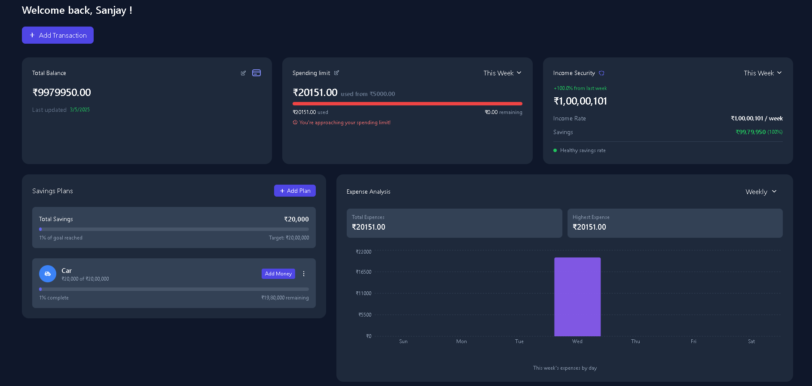

# Collecting workspace information# Personal Finance Visualizer

A comprehensive financial management application built with the MERN stack (MongoDB, Express.js, React, Node.js). This application enables users to track expenses, manage savings goals, and visualize financial data through an intuitive dashboard interface.



## Features

- **Transaction Tracking**: Add, edit, and view expenses and income transactions
- **Interactive Dashboard**: View balance, spending statistics, and income security metrics
- **Savings Plans**: Create and manage savings goals with progress tracking
- **Expense Analysis**: Analyze spending patterns with interactive charts across different time frames
- **Spending Limits**: Set and monitor spending limits (daily, weekly, monthly)
- **Transaction History**: Search, filter, and manage transaction history
- **Responsive Design**: Works seamlessly across desktop and mobile devices

## Tech Stack

### Frontend
- **React**: For building the user interface
- **Tailwind CSS**: For modern, utility-first styling
- **Vite**: For fast development and bundling
- **Recharts/Chart.js**: For data visualization components
- **Axios**: For HTTP requests to the backend API

### Backend
- **Node.js**: Runtime environment for the server
- **Express.js**: Web application framework
- **MongoDB**: NoSQL database for storing financial data
- **Mongoose**: MongoDB object modeling for Node.js

### Development Tools
- **Nodemon**: For automatic server restarts during development
- **Cors**: For handling Cross-Origin Resource Sharing
- **dotenv**: For environment variable management

## Project Structure

The project follows a client-server architecture:

```
PersonalFinanceVisualizer/
├── client/                  # React frontend
│   ├── public/              # Static assets
│   └── src/                 # React source code
│       ├── Components/      # React components
│       ├── assets/          # Static assets
│       ├── lib/             # Utility functions
│       └── main.jsx         # Entry point
└── server/                  # Node.js backend
    ├── models/              # MongoDB models
    │   ├── Transaction.js   # Transaction model
    │   ├── SavingsPlan.js   # Savings plan model
    │   └── SpendingLimit.js # Spending limit model
    └── index.js             # Express server entry point
```

## API Integration

The application interacts with the backend through a RESTful API:

### Endpoints

| Method | Endpoint                    | Description                    | Request Body                          |
|--------|----------------------------|--------------------------------|--------------------------------------|
| GET    | /api/transactions          | Fetch all transactions         | -                                    |
| POST   | /api/transactions          | Add new transaction            | `{description, amount, type, category, date}` |
| PUT    | /api/transactions/:id      | Update transaction             | `{description, amount, type, category, date}` |
| DELETE | /api/transactions/:id      | Delete transaction             | -                                    |
| GET    | /api/savings-plans         | Fetch all savings plans        | -                                    |
| POST   | /api/savings-plans         | Add new savings plan           | `{name, targetAmount, icon, iconBg}`  |
| PUT    | /api/savings-plans/:id     | Update savings plan            | `{name, targetAmount, currentAmount, icon, iconBg}` |
| DELETE | /api/savings-plans/:id     | Delete savings plan            | -                                    |
| GET    | /api/spending-limits       | Fetch all spending limits      | -                                    |
| GET    | /api/spending-limits/:period | Fetch spending limit by period | -                                  |
| POST   | /api/spending-limits       | Add/update spending limit      | `{category, limit, period}`          |
| POST   | /api/balance/adjust        | Adjust balance                 | `{newBalance}`                       |

## Setup Instructions

### Prerequisites

- Node.js (v16+ recommended)
- MongoDB (v4+ recommended)
- npm or yarn package manager

### Backend Setup

1. Clone the repository
   ```bash
   git clone https://github.com/yourusername/PersonalFinanceVisualizer.git
   cd PersonalFinanceVisualizer
   ```

2. Install server dependencies
   ```bash
   cd server
   npm install
   ```

3. Create a .env file in the server directory with the following content:
   ```
   MONGODB_URI=mongodb+srv://your-connection-string
   PORT=8000
   ```

4. Start the server
   ```bash
   node index.js
   # Or with nodemon for development
   npx nodemon index.js
   ```

### Frontend Setup

1. Open a new terminal and navigate to the client directory
   ```bash
   cd ../client
   ```

2. Install client dependencies
   ```bash
   npm install
   ```

3. Start the development server
   ```bash
   npm run dev
   ```
   
   The client will run on http://localhost:5173

## MongoDB Schema

### Transaction Schema
```javascript
{
  amount: Number,        // Required
  description: String,   // Required
  date: Date,            // Required, default: Date.now
  type: String,          // Required, enum: ['expense', 'income']
  category: String,      // Required
}
```

### SavingsPlan Schema
```javascript
{
  name: String,          // Required
  targetAmount: Number,  // Required
  currentAmount: Number, // Default: 0
  category: String,      // Default: 'Other'
  icon: String,          // Default: 'ti ti-piggy-bank'
  iconBg: String,        // Default: 'bg-indigo-500'
  createdAt: Date        // Default: Date.now
}
```

### SpendingLimit Schema
```javascript
{
  category: String,      // Required 
  limit: Number,         // Required
  period: String,        // Required, enum: ['daily', 'weekly', 'monthly']
}
```

## Usage Guide

1. **Dashboard Overview**: View your financial snapshot with balance, spending, and income statistics
2. **Adding Transactions**: Click "Add Transaction" button to record expenses or income
3. **Savings Goals**: Create and track savings goals in the Savings Plans section
4. **Expense Analysis**: View spending patterns by day, week, month, or year
5. **Transaction History**: Search, filter, and manage your transaction history
6. **Setting Limits**: Set spending limits to help manage your budget

## Contributors

- [Your Name](https://github.com/yourusername)

## License

This project is licensed under the MIT License - see the LICENSE file for details.